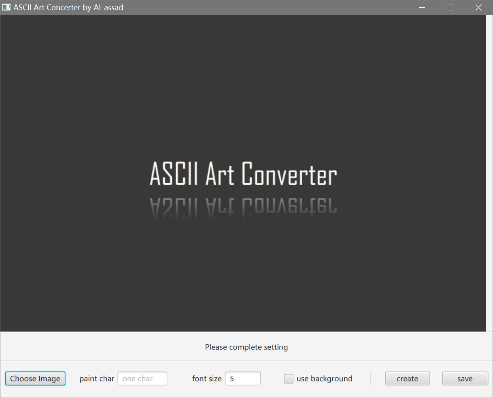
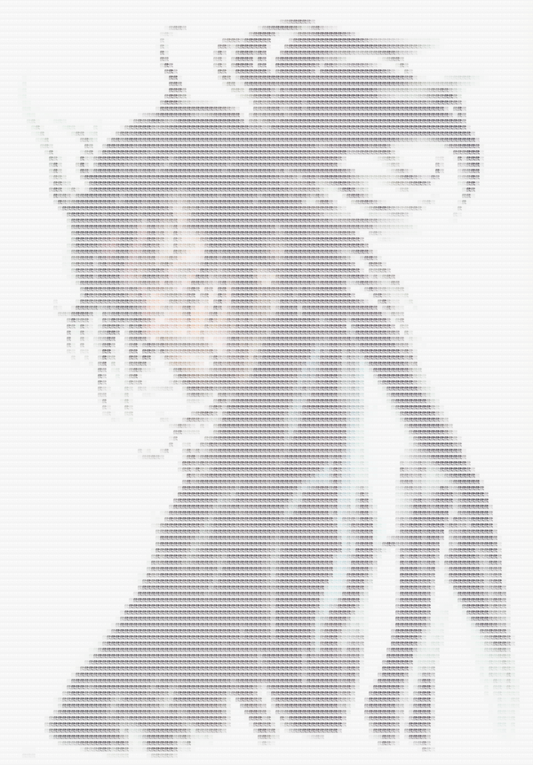
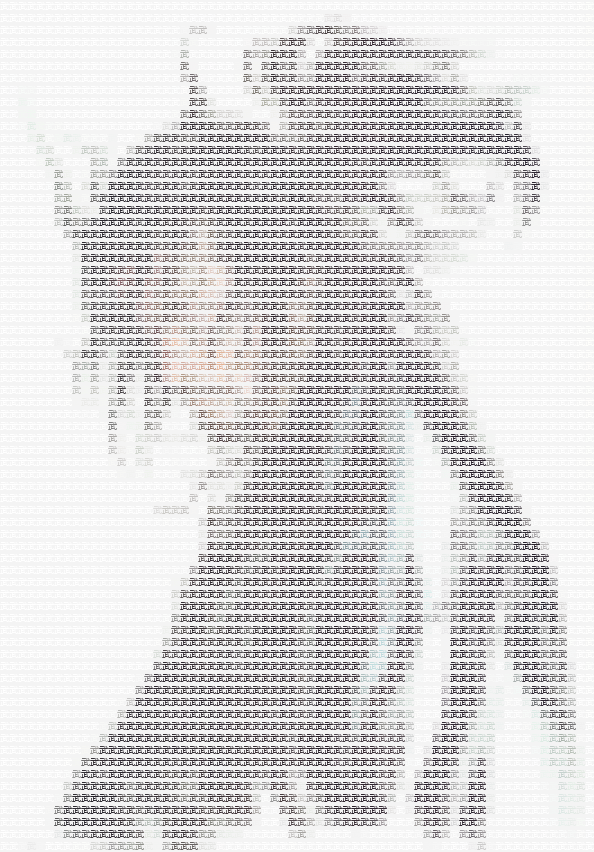
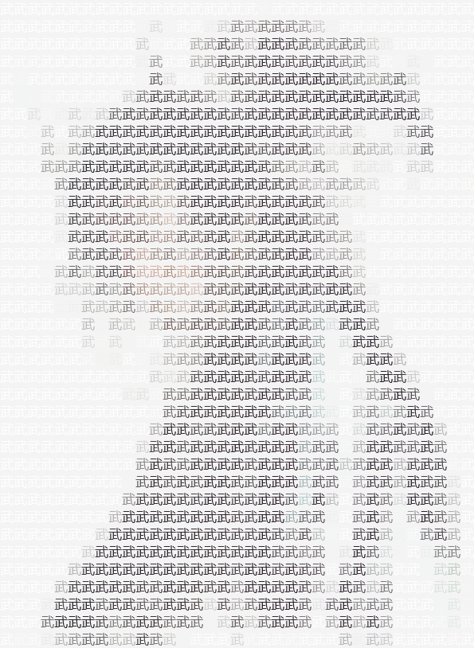

# ASCII-Art-Converter  
## 字符画转化器

### 依赖环境  
* Java8  
* JavaFX8

### 简述  
核心转化类：Converter.Converter  
视图和控件逻辑处理：View  
打包为jar的工程：ASCII Art Converter.jar  
使用指定的字符替换图片中单位区域的像素点，可自定义字符大小和是否使用全图提取背景色；

### 样张 
 
 

